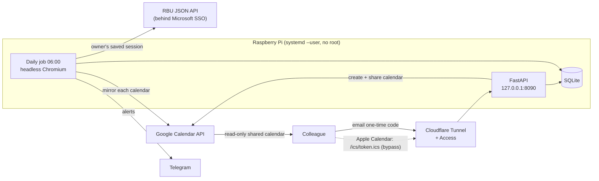

# Vaktkalender

Puts Red Bull Student Marketeer shifts from RBU (Red Bull's internal planning tool) into each colleague's own Google or Apple calendar. It updates automatically, and colleagues set it up with one tap.

A colleague opens the site, logs in with a one-time code sent to their email, and types their RBU code (first letter of first name + surname). They see a preview of their upcoming shifts, then press **Legg til i Google Kalender** or **Legg til i Apple Kalender**. From then on, new, changed and cancelled shifts show up in their calendar without them doing anything.

It runs on a Raspberry Pi for about 30 colleagues across three cities.

> Personal hobby project. Not affiliated with or endorsed by Red Bull. The UI is in Norwegian; code and docs are in English.

## Architecture



There are two processes, and they share one SQLite database:

| Process | systemd unit | Job |
| --- | --- | --- |
| `python -m vaktkalender run` | `vaktkalender-run.service` + `.timer` | Fetch every team's shifts from RBU, store them, mirror them to every linked Google calendar, send alerts |
| `uvicorn vaktkalender.web:create_app` | `vaktkalender-web.service` | Onboarding website, ICS feeds, admin page |

**Stack:** Python 3.13, FastAPI + Jinja2 (server-rendered, no frontend framework), Playwright, SQLite, Google Calendar REST API through a service account, PyJWT, Cloudflare Tunnel + Access, systemd, Telegram Bot API.

## How it works

### 1. Getting shifts out of RBU

RBU is a single-page app behind Microsoft SSO, and it has no public API or calendar export. Only a real browser can get through the SSO redirects, so `rbu.py`:

1. Starts headless Chromium with a saved Playwright `storage_state` (the owner's cookies, including Microsoft's "stay signed in" cookie).
2. Loads the app once, only far enough for the SSO to re-authenticate silently. It waits for the app's own `GET /api/currentSession` response instead of waiting for the page to finish loading. Images, fonts, media and analytics are blocked to keep this fast on a Pi.
3. Calls RBU's JSON API directly through the **same browser context** (`ctx.request`), so the cookies come along automatically:
   - `/api/orgunits/structure` → walks the org tree to find every active `TEAM` (new teams are picked up automatically)
   - `/api/orgunits/{team}/calendar?year=&month=` → each team's missions for the current and next month
4. Saves the refreshed cookies back atomically (write to a temp file, `chmod 600`, `os.replace`) to keep the session alive.

No HTML is parsed. A full run for three teams takes about 10 seconds. RBU's addresses (`RBU_APP_URL`, `RBU_API_URL`) are read from the Pi's config, so they aren't in this repo.

**When the session expires:** it's detected in two ways. Either the browser ends up on a different domain than RBU's own (the SSO login page), or the API returns 401/403. Both raise `RbuLoginExpired`, which sends a Telegram message containing the exact command to fix it. The expiry time of Microsoft's `ESTSAUTHPERSISTENT` cookie is read from the saved session, and the owner gets a warning 7 days before it runs out (about every 90 days). `./login_rbu.sh` reads RBU's addresses from the Pi's config, opens a visible browser on the Mac for the owner to log in, then copies the new session to the Pi with `scp` and starts a fetch.

### 2. Parsing (`shifts.py`, pure functions)

- One `Shift` per (mission, person). A mission with three people becomes three shifts. Each shift lists the other people on it as coworkers.
- **Timezone quirk:** RBU sends `"10:00:00Z"` but means 10:00 *Oslo time*, and that's how RBU's own UI shows it. Times are reinterpreted as `Europe/Oslo` wall-clock time before converting to UTC. There's a test for this.
- Statuses: `CANCELED`/`DELETED` are inactive and get removed from calendars. `DRAFT` stays but is marked "(utkast)".
- People can appear in several team calendars. Their home team is the one where they have the most shifts.
- Code matching uses `fold()`, so `Ø`/`o`, `Æ`/`ae`, upper/lower case and stray spaces all match.

### 3. Storage (`db.py`)

SQLite in WAL mode, so the web process and the daily job can use it at the same time.

- **Sliding window:** each run replaces only shifts that start in the current and next month, in one transaction. Older shifts are kept as history.
- **Empty-scrape guard:** if RBU returns zero shifts but the database has some in that period, the run is aborted (`SuspiciousSnapshot`) instead of wiping everyone's calendars.
- **Single run at a time:** an `fcntl.flock` on a lock file prevents overlap between the daily run and a manual "fetch now".
- **Migrations:** small ones only. New columns are added when `PRAGMA table_info` shows they're missing.
- Tables: `employees`, `shifts`, `members` (email ↔ code, ICS token, Google calendar id, sync status), `runs`, `published_months`.

### 4. Google Calendar (`gcal.py`)

**Why a service account and not per-user OAuth:** an unverified OAuth app in "Testing" mode gets refresh tokens that expire after 7 days, and every colleague would have to go through a consent screen. Instead, a service account **owns** one "Red Bull-vakter" calendar per colleague and shares it with them read-only (an ACL `reader` rule). Colleagues never grant any permissions. They just add a calendar that has been shared with them.

**Mirroring:** each calendar should match that person's shifts in the database exactly.

- Event ids are deterministic: `rbu<missionId>`. Google requires ids in base32hex (`0-9a-v`), so the prefix only uses those characters.
- Each event body is hashed (SHA-256), and the hash is stored in `extendedProperties.private.fp`. A sync lists the existing events, compares hashes, and only sends real changes: inserts, `PUT` updates, and deletes for shifts that disappeared or were cancelled.
- If an insert returns `409` (the id was used by an earlier, deleted event), it becomes a `PUT`.
- On rate limits (`429`, or `403 rateLimitExceeded`) and `5xx` errors, it retries with exponential backoff plus jitter, capped at 64 s: 8 retries, about 3 minutes.

**The "Add to Google" button:** it's guarded by a lock, so a double tap can't create two calendars. The calendar is created and shared immediately, then filled in a background task so the response comes back right away. This was learned the hard way: a slow, throttled sync inside the request made one user tap 8 times, which created 8 calendars. `python -m vaktkalender check` lists sync errors and "orphan" calendars that no member points to.

### 5. Apple Calendar and everything else (`ics.py`)

Each member gets a personal feed at `/ics/<token>.ics`. The token is `secrets.token_urlsafe(24)` (192 bits). The feed is written by hand according to RFC 5545: text escaping, line folding at 75 octets that never splits a UTF-8 character, stable `UID`s, and `REFRESH-INTERVAL: PT1H`. It answers `HEAD` too, because some calendar apps check with HEAD first. Each fetch records when it happened and which app fetched it, so the admin page can show whether someone's subscription actually works.

The Apple button links to `webcal://`, but only Safari on iOS passes those links on to the Calendar app. The page detects Chrome, Firefox, Edge, the Google app and in-app browsers (Instagram, Messenger, Snapchat, …) from the User-Agent. In those, it shows a copy-link button and manual "add subscription" steps instead.

### 6. Web app (`web.py`)

| Route | Purpose |
| --- | --- |
| `GET /` | Start page (enter your code) or, once linked, your next shifts + calendar buttons |
| `POST /kode` | Look up a code and show a preview of that person's upcoming shifts |
| `POST /koble` | Link the logged-in email to that code (one email per code) |
| `POST /google` | Create + share the Google calendar, then redirect to Google's "add calendar" page |
| `POST /koble-fra` | Unlink: delete the Google calendar and the member row (the ICS token dies with it) |
| `GET/HEAD /ics/{token}.ics` | The feed |
| `GET /admin` | Members, sync status, last feed fetch, unclaimed codes, recent runs, RBU session expiry |
| `POST /admin/scrape` | "Fetch now". Starts a detached `vaktkalender run` |
| `POST /admin/fjern` | Remove a member |
| `GET /healthz` | Health check for deploys |

Everything is rendered on the server with Jinja2 (autoescaped). The only JavaScript is decorative: a pixel-art can walks across a background calendar and "paints" the viewer's shift days. It turns itself off with `prefers-reduced-motion`. Static asset URLs include a content hash, so Cloudflare never serves an old stylesheet after a deploy. FastAPI's `/docs` and `/openapi.json` are turned off. The pixel art is generated from ASCII maps by `scripts/make_pixel_art.py`.

### 7. Security model

| Layer | What it does |
| --- | --- |
| **No open ports** | uvicorn only listens on `127.0.0.1`. The only way in from outside is a Cloudflare Tunnel (`cloudflared` connects outward from the Pi). |
| **Cloudflare Access** | Email one-time PIN. Only addresses on an allowlist the owner manages can log in. |
| **JWT verified at the origin** (`access.py`) | The app doesn't trust a header saying who the user is. It verifies Cloudflare's signed `Cf-Access-Jwt-Assertion` token (RS256, keys from the team's JWKS endpoint, and checks audience + issuer). If Access is ever misconfigured, everyone gets locked out instead of everyone getting in. |
| **ICS bypass** | Calendar apps can't log in, so `/ics/*` is an Access bypass. The 192-bit token in the URL is the credential, and unknown tokens return 404. |
| **CSRF** | Every `POST` must have an `Origin`/`Referer` from the site's own host. |
| **Admin** | A separate email allowlist (`ADMIN_EMAILS`). |
| **Secrets** | Kept outside the repo in `~/.config/vaktkalender/` on the Pi, mode `600`: `config.env`, the RBU session, the Google service-account key. The Telegram token is never logged, because `requests` errors include the URL and the URL contains the token. There's a test for this. |

Known trade-off: any logged-in colleague can preview any code's upcoming shifts. That's fine for a small, trusted group that already shares a schedule. A bigger deployment would need to restrict it.

### 8. Operations

- **Scheduling:** a systemd timer runs at 06:00 `Europe/Oslo` with `Persistent=true`, so a run missed while the Pi was off happens at the next boot. It also waits a random 0–5 minutes before starting. Everything runs as the user's own systemd services, with `loginctl enable-linger` so they keep running when nobody is logged in. No root needed.
- **Alerts (Telegram):** fetch failures, expired login (with the fix command), login expiring within 7 days, Google sync failures (only when the error changes), and "📅 November is published in RBU: N shifts for M people" once per new month.
- **Health check:** `python -m vaktkalender check` checks the RBU session expiry, Google access, orphan calendars, the Telegram config, the Cloudflare JWKS endpoint and the admin list.

## Project layout

```
vaktkalender/
├── vaktkalender/
│   ├── __main__.py      CLI: run · sync · login · check · test-telegram
│   ├── rbu.py           Playwright session + RBU JSON API
│   ├── shifts.py        Domain types, parsing, time quirks (pure)
│   ├── db.py            SQLite store
│   ├── job.py           The daily run
│   ├── gcal.py          Google Calendar mirroring
│   ├── ics.py           iCalendar feed
│   ├── web.py           FastAPI app
│   ├── access.py        Cloudflare Access JWT verification
│   ├── telegram.py      Owner alerts
│   ├── config.py        Settings from environment
│   ├── templates/       Jinja2 pages (Norwegian)
│   └── static/          CSS, pixel art, painter animation
├── tests/               pytest, fictional data only
├── systemd/             user units + timer
├── scripts/
│   ├── setup_wizard.sh  Guided setup of Telegram, Google Cloud and Cloudflare
│   ├── setup_telegram.sh
│   └── make_pixel_art.py
├── deploy.sh            rsync to the Pi over Tailscale, install, restart, health check
├── login_rbu.sh         Renew the RBU session from the Mac
└── config.example.env   Every setting, documented
```

## Running it

### Locally

```bash
uv venv --python 3.13 .venv
uv pip install --python .venv/bin/python -r requirements.txt pytest httpx
.venv/bin/python -m pytest

# DEV_USER_EMAIL skips Cloudflare Access. Local development only, never in production.
DEV_USER_EMAIL=you@example.com .venv/bin/uvicorn vaktkalender.web:create_app --factory --port 8090
```

### On a Pi

You need: a Raspberry Pi (tested on Debian 13 arm64) with Chromium and `loginctl enable-linger` for your user, SSH access from your Mac (e.g. over Tailscale), a domain on Cloudflare, and a free Google Cloud project.

1. Create `local.env` in this folder with one line, `PI=<ssh name of your Pi>`. It's gitignored, and every script reads it.
2. `./deploy.sh`. This copies the code, creates the venv, installs the systemd units and creates `~/.config/vaktkalender/config.env` from `config.example.env`.
3. Fill in `PUBLIC_URL`, `ADMIN_EMAILS`, `CONTACT_NAME`, `RBU_APP_URL` and `RBU_API_URL` in that file on the Pi.
4. `./login_rbu.sh`. Log in to RBU in the browser window that opens.
5. `./scripts/setup_wizard.sh`. It walks you through Telegram, the Google service account, the tunnel hostname and both Access applications (the site + the `/ics/*` bypass), checking each step as you go.
6. Add colleagues' email addresses to the Access policy.

| Task | Command |
| --- | --- |
| Deploy code | `./deploy.sh` |
| Renew RBU login (Telegram tells you when) | `./login_rbu.sh` |
| Fetch now | `/admin` → **Hent fra RBU nå** |
| Health check | `ssh $PI 'cd ~/vaktkalender/app && set -a && . ~/.config/vaktkalender/config.env && set +a && ../.venv/bin/python -m vaktkalender check'` |
| Logs | `ssh $PI journalctl _SYSTEMD_USER_UNIT=vaktkalender-web.service _SYSTEMD_USER_UNIT=vaktkalender-run.service -n 50` |

Files on the Pi:

- `~/vaktkalender/app/`: code (replaced by every deploy)
- `~/.config/vaktkalender/`: `config.env`, `storage_state.json`, `google-service-account.json` (all `600`)
- `~/.local/share/vaktkalender/vaktkalender.db`: data

## Configuration

All settings are environment variables. systemd loads them from `config.env`. See [`config.example.env`](config.example.env).

| Variable | Meaning |
| --- | --- |
| `PUBLIC_URL` | The site's public address (used for links and the CSRF origin check) |
| `RBU_APP_URL`, `RBU_API_URL` | RBU's web app and JSON API (kept out of the code) |
| `ADMIN_EMAILS` | Comma-separated, may open `/admin` |
| `CONTACT_NAME` | Who colleagues are told to contact |
| `RBU_TEAM_IDS` | Empty = every team the account can see |
| `CF_ACCESS_TEAM_DOMAIN`, `CF_ACCESS_AUD` | Used to verify the Access JWT |
| `GOOGLE_SERVICE_ACCOUNT_FILE` | Service-account key (Google is disabled if missing) |
| `TELEGRAM_BOT_TOKEN`, `TELEGRAM_CHAT_ID` | Alerts (silently off if missing) |
| `TIMEZONE`, `CHROMIUM_PATH`, `LOGIN_COMMAND` | Mostly left at the defaults |

## Tests

35 pytest tests, all using fictional people and fake RBU responses. None of them touch the network. They cover:

- **Parsing:** one shift per person per mission, the Oslo-time quirk, status handling, de-duplication across months, home-team choice, walking the org tree, forgiving code matching
- **RBU:** its addresses come from config, and a missing one fails before any browser starts
- **Storage:** the sliding window keeps history, an empty scrape never wipes data, one email per code, "new month" is announced only once, old databases get migrated
- **Google:** stable ids and local times, the diff only touches what changed, cancelled shifts are removed, rate limits are waited out, it gives up after the retry limit
- **ICS:** escaping, folding, cancelled shifts left out
- **Web:** the full onboarding flow, cross-site POSTs are rejected, feeds need a valid token, admin-only routes, JWT signature + audience checks, a double tap creates one calendar, the iPhone-browser warning, feed-fetch tracking
- **Telegram:** the token never shows up in logs

## What's not in this repo

Configuration (including RBU's addresses, and the Pi's name in `local.env`), the RBU session, the Google key, the database and anything with real names or shifts. `.gitignore` blocks all of them.
